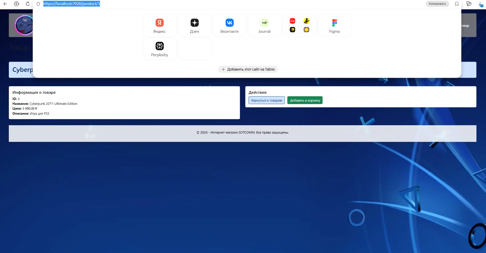
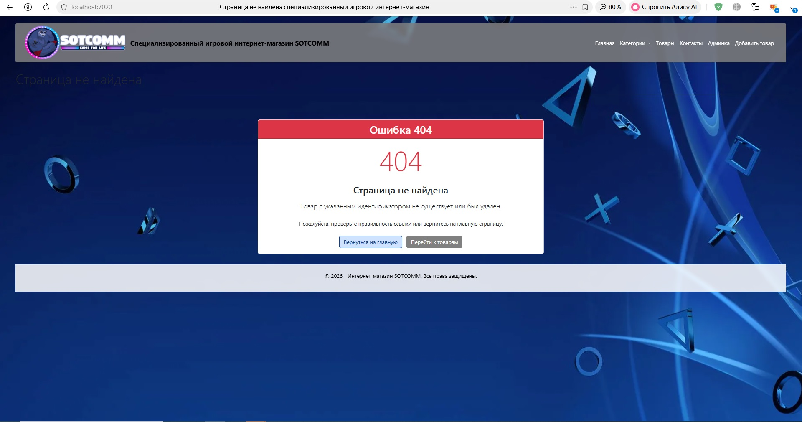
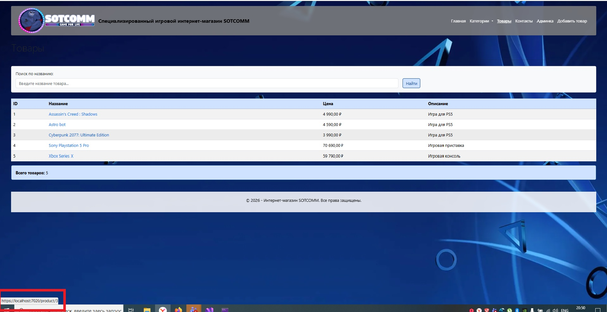

# Интернет-магазин (учебный проект) - Этап 10

## Описание проекта

На данном этапе в проект добавлена `страница детального просмотра товара`, реализована `навигация со страницы списка товаров на страницу деталей`, создана `страница ошибки 404` для некорректных ссылок, а также добавлен `фильтр ресурсов` для проверки существования товара.

## Функциональность

В проекте реализовано:
- контроллер `HomeController` с внедрением зависимости `ProductService`;
- модель `Product` с атрибутами валидации;
- модели представлений `HomeViewModel`, `ProductViewModel`, `ContactViewModel`;
- сервис `ProductService` для централизованного управления данными;
- **фильтр ресурсов** `ProductExistsFilter` для проверки существования товара;
- контроллер `ProductController` для управления добавлением товаров;
- 4 `Tag Helper` для вынесения повторяющихся элементов;
- 5 `ViewComponents` для сложных блоков интерфейса;
- макет `_Layout.cshtml` для всех страниц с навигацией и фоновым изображением;
- область Admin с отдельным контроллером и представлениями;
- восемь страниц (представления):
  - **главная страница (Index)** — приветствие и описание магазина;
  - **страница с товарами (Products)** — динамический список товаров с поиском (названия товаров являются ссылками);
  - **страница контактов (Contact)** — адрес, телефон, email, часы работы;
  - **страница деталей товара (ProductDetails)** — полная информация о товаре по ID;
  - **страница "О нас" (About)** — информация о компании;
  - **панель администратора (Admin/Dashboard)** — статистика и управление;
  - **форма добавления товара (Product/Create)** — с валидацией данных;
  - **страница ошибки (Error)** — отображается при переходе по несуществующему ID товара.

## Скриншоты

### Проверка страницы деталей товара:

 

### Проверка страницы ошибки для неверного ID:

 

### Проверка ссылок на странице товаров

 